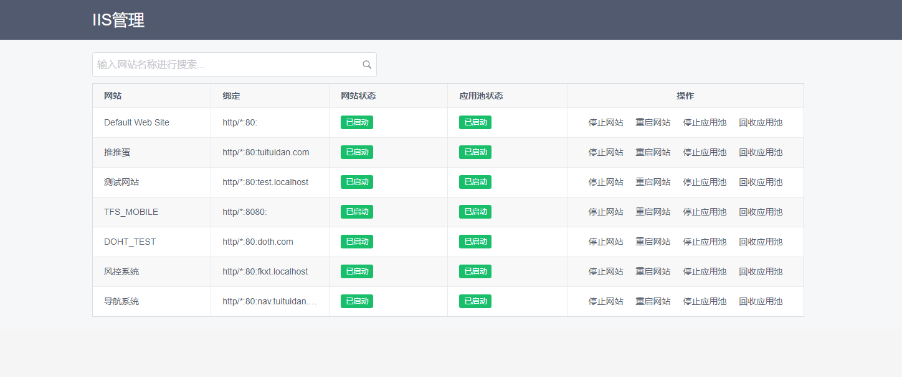

# IIS管理

## 背景

近来帮.NET组的人维护一些.NET的老项目，项目使用IIS部署，上面部署了很多个应用，由不同的人进行维护，每次部署总是出现争抢远程登录的情况，增加Windows登录账号也无法解决，毕竟你并不知道你将要登录的账号是否有人正在使用。

替换发布文件使用FTP即可解决，但是有些文件替换IIS无法检测，还是需要手动在IIS上重启应用，于是我就想IIS是否有像Tomcat那样的基于web的管理页面，搜索一番只搜到一个[Servant for IIS](https://www.iis.net/downloads/community/2013/05/servant-for-iis)，看起来就是解决web上访问IIS的，然而很遗憾的是下载链接对应的github仓库已经被删除了，没能找到可以下载的地方，似乎是已经被放弃的项目，也没找到其他可以替代的产品，于是考虑自己简单实现一个。

## 实现原理

IIS7开始提供的`C:\Windows\System32\inetsrv\appcmd.exe`这个工具可以通过cmd命令来管理IIS

- `appcmd list site`命令：获取IIS应用列表，其中有各个网站的名称，绑定域名，状态等
- `appcmd start site "XX网站"`：启动IIS下的XX网站
- `appcmd stop site "XX网站"`：停止IIS下的XX网站

## license

100%开源，MIT协议，可自由修改

## 页面展示

